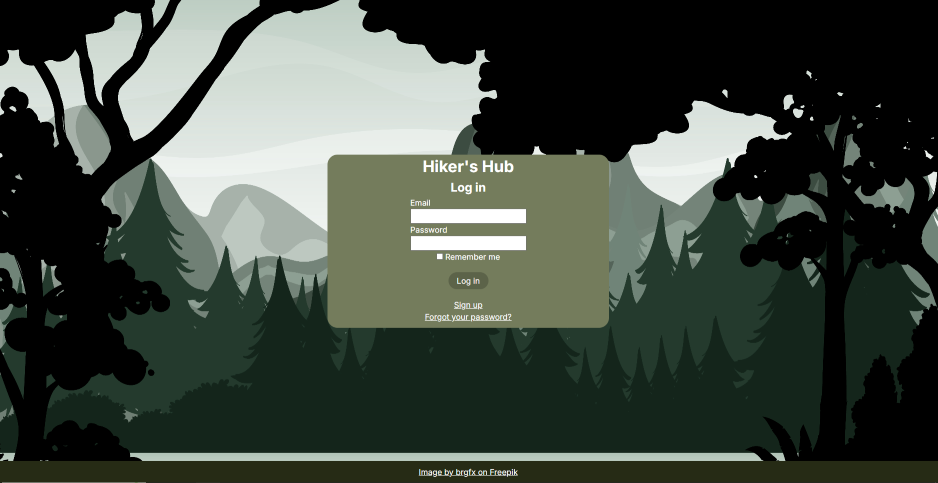
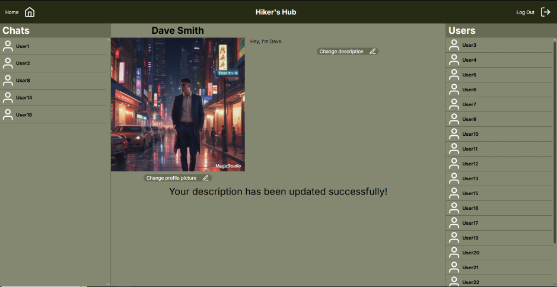
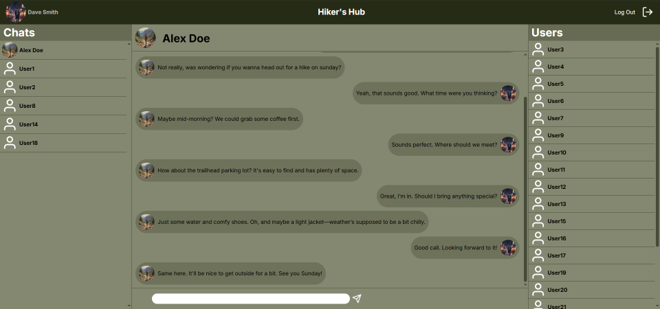
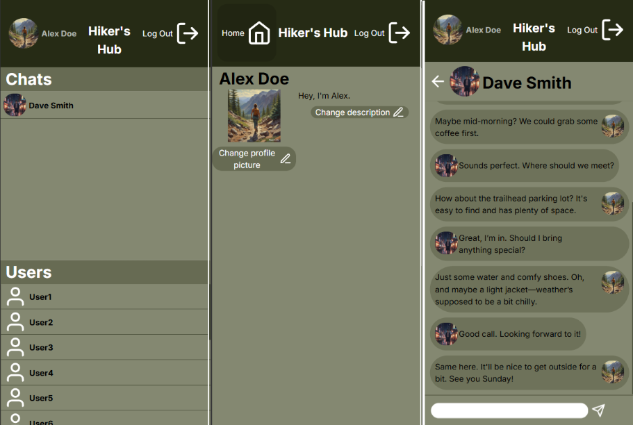

# Hiker's Hub, Messaging App

This is a full stack messaging app that, in concept, would be a messaging app for hikers. The Rails backend is mostly used as an API, with the rails application layout view and the turbo:load event being used to mount the React frontend.

Past the Devise login pages, this is an SPA.

## Tech Stack
 * Frontend: React
 * Backend: Ruby on Rails
 * Database PostgreSQL

 ## Getting Started

  1. Clone the repo  
  2. Install dependencies  
    - `npm install` (frontend)  
    - `bundle install` (backend)
  3. Start the app via `bin/dev`

## Features

  * Devise authentication
  * Displays a list of users that you have not yet started a chat with
  * Remembers users that you have started a chat with and display them in a separate list
  * Lazy loading with infinite scrolling for the lists mentioned above as well as the chat itself
  * Allows the user to:
    * View the profile of other users by hovering over their name in the user list or clicking on their banner in an open chat
    * Send messages to other users
    * Edit their own profile with a profile picture and a description
    * Both the frontend and backend ensure that users cannot edit the profile of other users
  * Supports mobile layouts

## Screenshots
  ### Login page
  

  ### Profile page
  

  ### Chat
  

  ### Mobile layout
  

## API Endpoints

  ### `POST /api/v1/chats/open?page=1`    
  * return a chat between the currently logged user and another user based on their uuid
  * if a chat between the two does not exist, it creates and returns a new one
  * uses pagination
  * parameters:
    - chat: root paramater
    - receiver_uuid: type: string, required: yes, description: the uuid of the user that the logged user wants to chat with
    - page, type: int, required: yes (query param), description: page number for paginated messages

  ### `POST /api/v1/messages/send`
  * creates a message associated to the chat that it was sent in
  * parameters: 
    - message: root paramater
    - content: type: string, required: yes, description: the content of the message that the user wishes to send
    - receiver_uuid: type: string, required: yes, description: the uuid of the user receiving the message

  ### `GET /api/v1/users/list`
  * returns a list of users that the currently logged-in user does not have an existing chat with

  ### `GET /api/v1/users/current`
  * returns the currently logged-in user

  ### `POST /api/v1/users/update`
  * updates the avatar or description of the currently logged-in user
  * parameters:
    - user: root parameter
    - description: type: string, required: no, description: the new description the user would like to set for themselves
    - avatar: type: file, required: no, description: the new avatar the user would like to set for themselves

  ### `GET /api/v1/users/chats`
  * returns a list of the chats the currently logged-in user has with other users
  * uses pagination
  * parameters:
    - page: type: integer, required: yes (query param), description: page number for pagination

## What I would have done differently

  * I would be more aware of the need for a mobile layout from the start and structure my components in a way that would make them less bloated with state. A fair amount of the state they share is state needed to display or hide child components during mobile rendering.

## To do

  * Fix the bloated state of my components
  * Add a search bar for the Chat and User lists
  * Add the ability to no longer display certain chats in the chat list, but still make it possible for the user to find them
  * Make the chat update in real time
  * Add user recommendations based on location
  * Add group chats 
  * Add an event planner where users can plan events or choose to attend them
